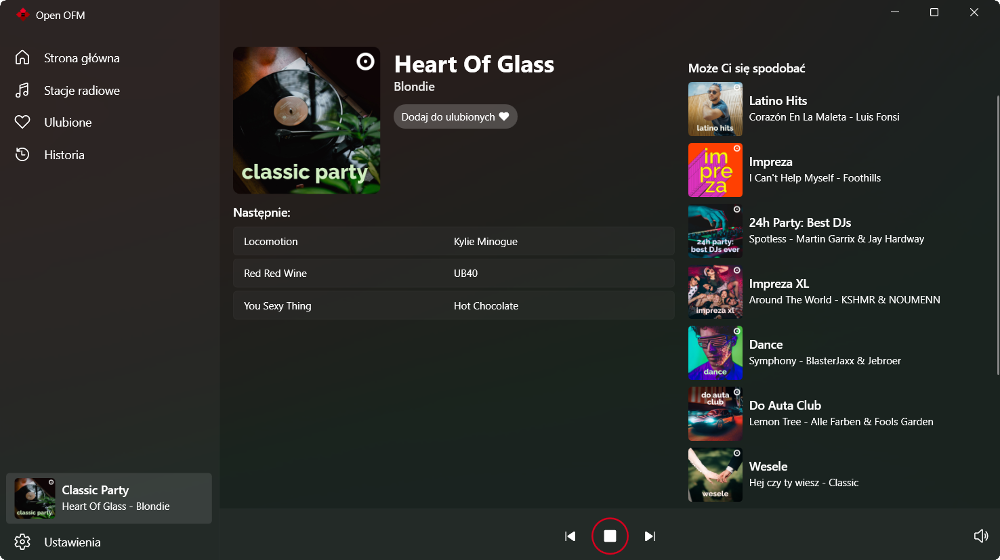

# Open OFM

Open OFM is a desktop player for polish internet radio service [OpenFM](https://open.fm/) written in C# and WPF. Open OFM features basic favourites and recommendation systems, a modern Windows 11 compatible design and theme support.

### Limitations
Due to a bug on the OpenFM's side, it is currently impossible to reliably implement all of the features I wanted (eg. history and pausing).